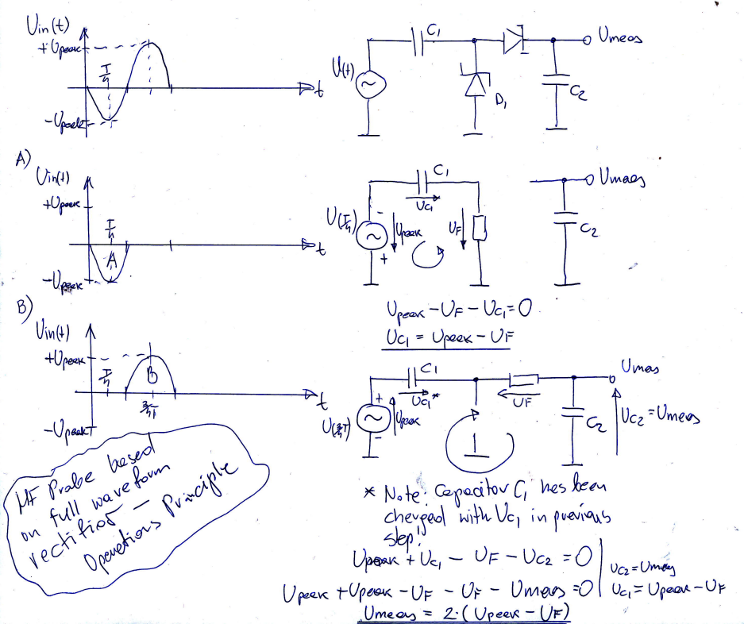
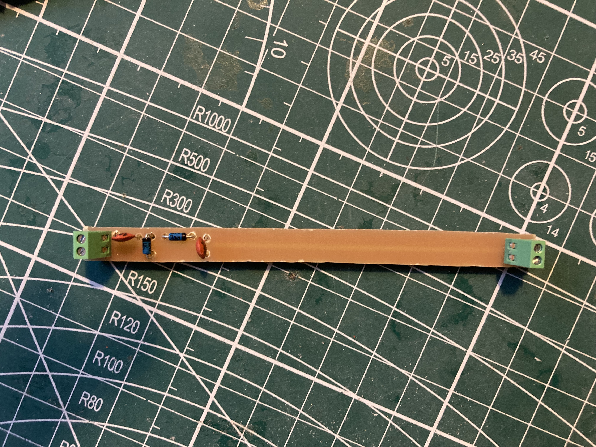
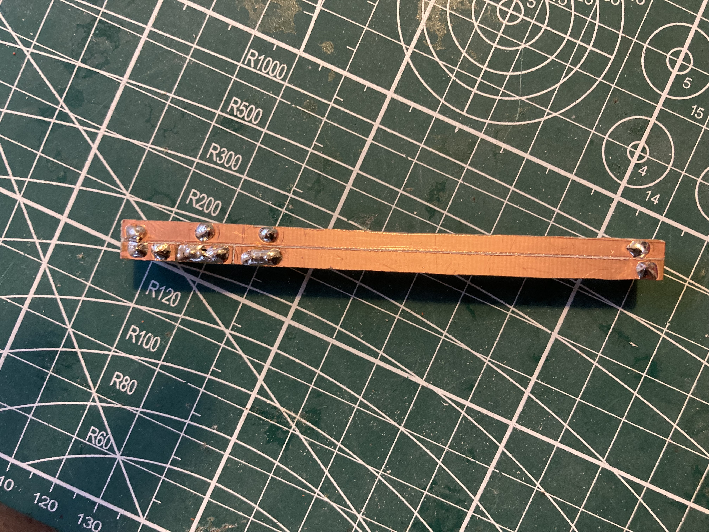
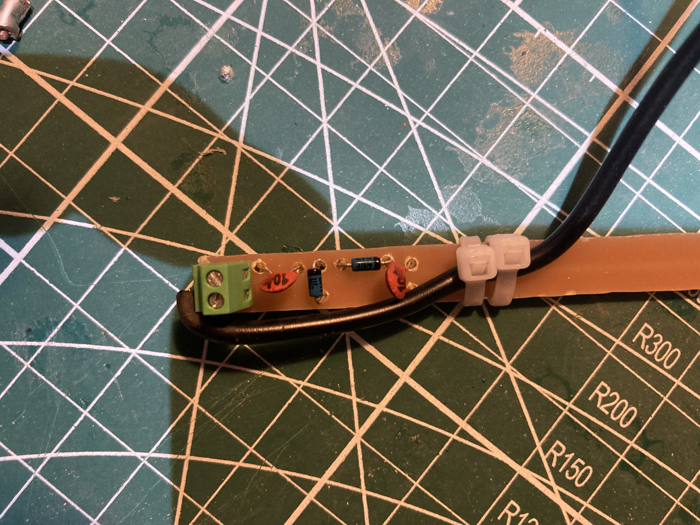
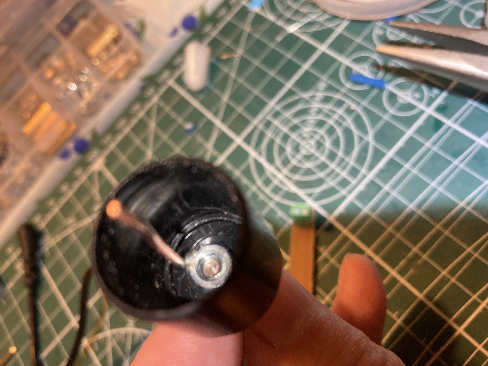
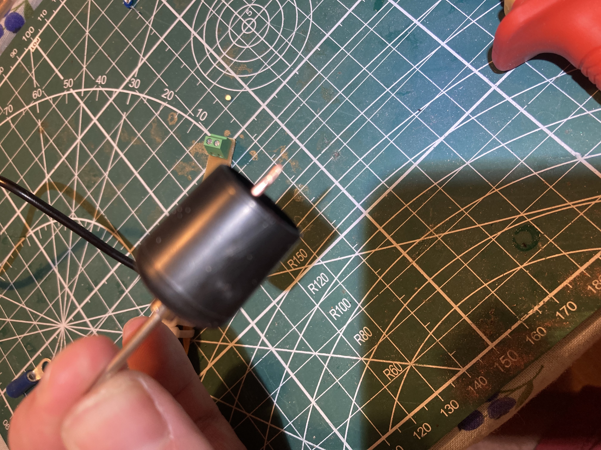
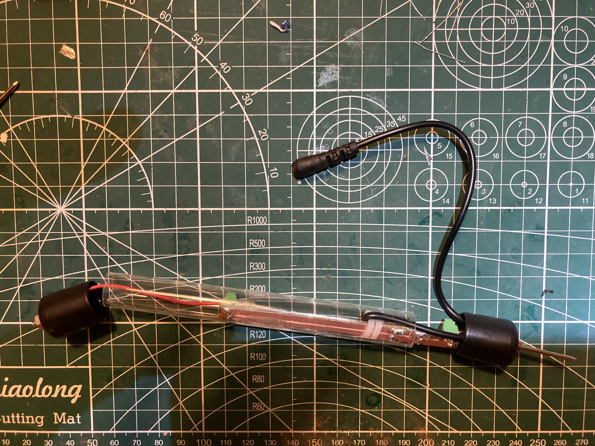
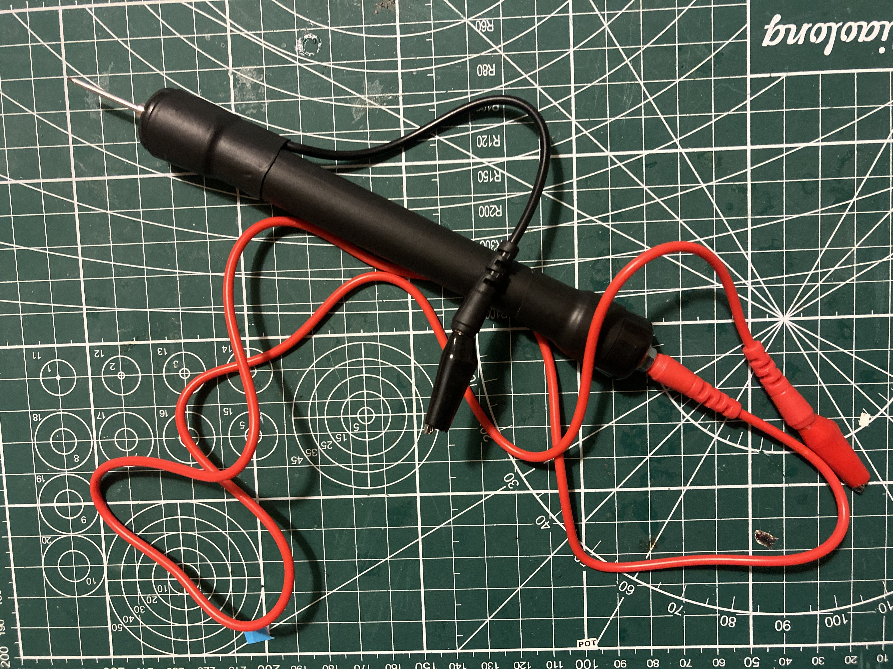

# RF_Probe

## Introduction

This document describes how to build HF probe based on full waveform rectifier. 
Full waveform rectifier design has been selected due to higher sensitivity compared to 
half waveform detector.
Document also provides theory of operation for HF probe and how this device can be used to 
measure transmitter output power.

## Electronic Circuit Diagram

To be added.

## The Theory of Operation

## Building the HF probe

To provide the idea how such probe can be built, series of photos describing device step by step
constrution are shown below:

### Step 1: Collecting all components

Key components:
Test Cables with connectors/needle - AVT:  L4126 Emcos - Test Lead Set
tube with plugs - Akwarysta24 (Allegro): PMMA 15/1mm
100nF ceramic capacitors (perferably high voltage of at least 100V)
Fast Shottky Diode with high Peak Reverse Voltage of at least 100V e.g. BAT-46
Small screw terminals - AVT: 2.54mm raster, 2 connectors, 8.5mm height

### Steo 2: Soldering Electronic Circuit

The easiest way to prepare pcb is to remove parts of conducting surface with 
sharp object such as knife.

### Steo 3: Securing Ground Probe's Wire

### Steo 4: Attaching Probe's Niddle

The easiest method is to solder 1mm wire to the nut, which is then put on the 
needle. Unsoldered end of the wire shall be put into hot 
connector of the screw terminal.

### Steo 5: Installing Electronics in the Tube

### Steo 6: Finished Product

To make the probe more visually apealing it is possible to put it into 
heat shrink sleeve (minimum diameter of 20mm).

## Calculating QRP Transmitter Output Power

Depending on RF probe type, formulas used to calculate output power differ slightly.
It shall be noted that it is possible to measure transmitter power using just a scope 
and dummy load, but for UHF frequencies, expensive high end scope has to be used.

In this section we will consider half-wave rectifier and full-wave rectifier (prototyped) probes.

In case of both designs we start with generic Power equations (we assume dummy load to be fully 
resistive in nature for all frequencies for which power measurements are conducted). We also assume
that measurements are done using only carrier frequency (unmodulated signal). In case of voice radio
such test signal is generated by pushing PTT button in total silence.

$P=U*I$

knowing that $R=U/I$, we can express current as: $I=U/R$, which when plugged into power equation above
gives us:

$P=U^2/R$

### Half-Wave Rectifier Probe Formulas

RF probe output voltage can be expressed as:

$Umeas=Upeak - Uf$, where Uf is the forward voltage drop on the single diode (in case of BAT46 Uf=0.45V)

from above equation Upeak can be calculated as:

$Upeak=Umeas+Uf$

Max power can be expressed as:

$Pmax=Upeak^2/R$

which gives:

$Pmax=(Umeas+Uf)^2/R$

Similarly, RMS power can be expressed as:

$Urms=Upeak/\sqrt(2)$, hence:

$Urms^2=Upeak^2/2$

$Prms=Upeak^2/2R$

$Prms=(Umeas+Uf)^2/2R$

### Full-Wave Rectifier Probe Formulas

RF probe output voltage can be expressed as:

$Umeas=2(Upeak - Uf)$, where Uf is voltage drop on single diode (in case of BAT46 Uf=0.45V)

from above equation Upeak can be calculated as:

$Upeak=(Umeas+2Uf)/2$

Max power can be expressed as:

$Pmax=(Umeas+2Uf)^2/4R$

Similarly, RMS power can be expressed as:

$Urms=Upeak/\sqrt(2)$, hence:

$Urms^2=Upeak^2/2$

$Prms=Upeak^2/2R$

$Prms=(Umeas+2Uf)^2/8R$

## Measuring QRP Transmitter Output Power

The test setup required to perfrom transmitter output power measurement:

Transmitter: TYT MD-790 set to low and high power settings
Dummy load: 50ohm resistor (RFR 50-250)
Osciloscope: Unit-T UTD2152CL

### Radio power set to low, f=144.1MHz

Umeas = 10V
R = 50ohm
Uf = 0.45V

$Pmax=(Umeas+2Uf)^2/4R=(10+0.9)^2/(4*50)=119/200=0.6W$

$Prms=(Umeas+2Uf)^2/8R=(10+0.9)^2/(8*50)=119/400=0.3W$

### Radio power set to high, f=144.1MHz

Umeas = 30V
R = 50ohm
Uf = 0.45V

$Pmax=(Umeas+2Uf)^2/4R=(31+0.9)^2/(4*50)=955/200=4.8W$

$Prms=(Umeas+2Uf)^2/8R=(31+0.9)^2/(8*50)=955/400=2.4W$

### Results Evaluation

Chinese vendors routinly specify transmit power as maximum power output Pmax...
In case of measured TYT MD-790, TYT user manual specifies transmit power 
of <5W for high power setting <1W for low power setting.

From conducted measurements it is evident that manual refers to Pmax and not 
to more applicable Prms...

## Resources

https://www.qsl.net/g3pto/probe.html
https://www.youtube.com/@ALLABOUTELECTRONICS